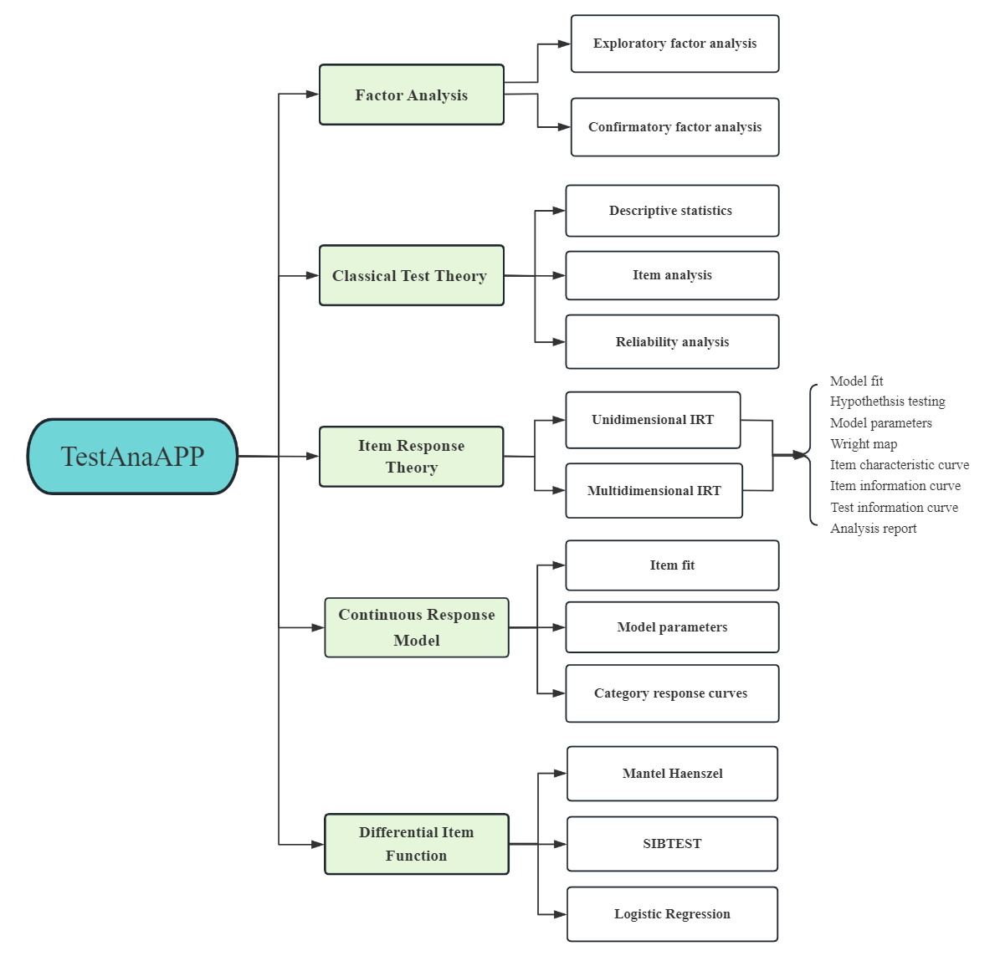
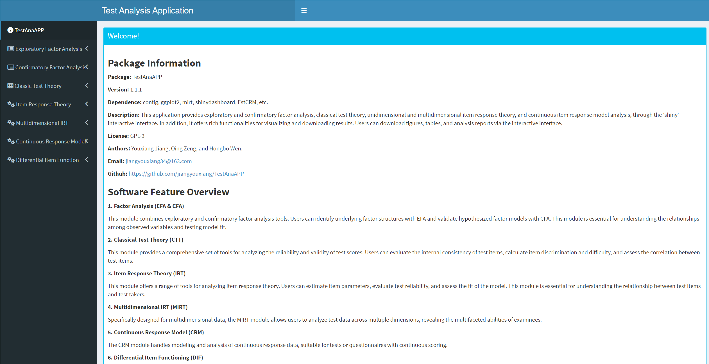

# TestAnaAPP
 
This application enables exploratory factor analysis, confirmatory factor analysis, classical measurement theory analysis, unidimensional item response theory, multidimensional item response theory, and continuous item response model analysis, through the shiny interactive interface. It also facilitates the visualization of the results. Users can easily download the analysis results from the interactive interface. Additionally, users can download a concise report about items and test quality on the interactive interface.

If you want to use this application to analysis data, you should install TestAnaAPP package in R.

## Installation

```
# install packages
install.packages("devtools")
devtools::install_github("jiangyouxiang/TestAnaAPP") 
library(TestAnaAPP)
TestAnaAPP::run_app() #run this application in R
```

## Functionality

The application has the following functionalities:



<p align="center"><strong>Figure 1. The framework of functionality of TestAnaAPP</strong></p>

## Home Page

The home page of the application is shown below:



<p align="center"><strong>Figure 2. The homepage of TestAnaAPP</strong></p>
